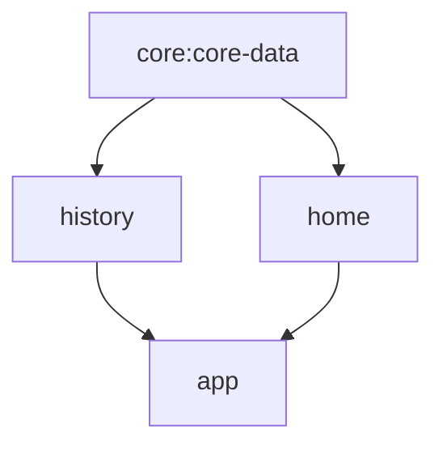

# Time Tracker
An Android app that allows users to select a start, end, and specified time, and calculates whether
the specified time in is in the time range. Results can be saved and viewed on the history screen.

### Architecture

The app is architected as the above. The core-data module provides access to the database for
both the history and home feature modules. The history and home feature modules are then used in
the NavHost in the app module.

### CI
There is a CI file that runs lint, unit tests, and builds the app on pull request, and push to main.

### Languages/Tools
The app is built in Kotlin with a toml & Kotlin DSL. It leverages Jetpack Compose for UI and Room
for database.

### Testing
The Repositories and ViewModels of the app are testing, using mock library [Mockito](https://site.mockito.org/).
These tests are run on CI, as mentioned earlier.